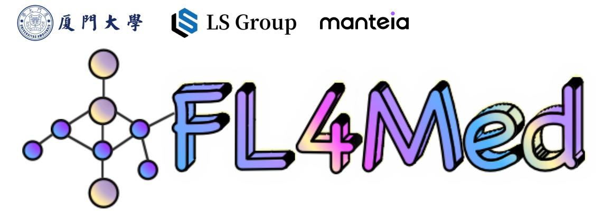

# Official-Repository-of-FL4Med

This repository provides the papers and code about federated learning for medical imaging (**FL4Med**) from our lab. More details are available on the corresponding websites. We will continue to dedicate ourselves to research in this area and regularly update this repository.

## Summary List
* Tackling Modality-Heterogeneous Client Drift Holistically for Heterogeneous Multimodal Federated Learning (TMI 2025)
* Model-Heterogeneous Semi-Supervised Federated Learning for Medical Image Segmentation (TMI 2024)
* Federated Self-supervised Domain Generalization for Label-effcient Polyp Segmentation (ADSMI 2024)
* FedDP: Dual Personalization in Federated Medical Image Segmentation (TMI 2023)
* Communication-Efficient Federated Skin Lesion Classification with Generalizable Dataset Distillation (MICCAI Workshop 2023)
* Personalizing Federated Medical Image Segmentation via Local Calibration (ECCV 2022)

## Tackling Modality-Heterogeneous Client Drift Holistically for Heterogeneous Multimodal Federated Learning 
TMI 2025| [paper](https://ieeexplore.ieee.org/document/10816602)
> [**Tackling Modality-Heterogeneous Client Drift Holistically for Heterogeneous Multimodal Federated Learning**](https://ieeexplore.ieee.org/document/10816602),    
> **Haoyue Song, Jiacheng Wang**, Jianjun Zhou, Liansheng Wang  
> In: IEEE Transactions on Medical Imaging (TMI)  

  

  

  
## Model-Heterogeneous Semi-Supervised Federated Learning for Medical Image Segmentation
TMI 2024| [paper](https://ieeexplore.ieee.org/abstract/document/10379169)
> [**Model-Heterogeneous Semi-Supervised Federated Learning for Medical Image Segmentation**](https://ieeexplore.ieee.org/document/10379169),    
> Yuxi Ma, Jiacheng Wang, Jing Yang, Liansheng Wang  
> In: IEEE Transactions on Medical Imaging (TMI)  

  

  

## Federated Self-supervised Domain Generalization for Label-effcient Polyp Segmentation
> **Xinyi Tan**, Jiacheng Wang, Liansheng Wang  
> In: Advancing Data Solutions in Medical Imaging AI (ADSMI), 2024   

  

## FedDP: Dual Personalization in Federated Medical Image Segmentation
TMI 2023| [paper](https://ieeexplore.ieee.org/abstract/document/10194959) 
> **Jiacheng Wang**, Yueming Jin, Danail Stoyanov, Liansheng Wang  
> In: IEEE Transactions on Medical Imaging (TMI)   
> [[Bibetex](https://github.com/jcwang123、FedDP#Citation)]

  

## Communication-Efficient Federated Skin Lesion Classification with Generalizable Dataset Distillation
> **Yuchen Tian**, Jiacheng Wang, Yueming Jin, Liansheng Wang  
> In: International Conference on Medical Image Computing and Computer-Assisted Intervention (MICCAI), 2023  
> [[arXiv](https://link.springer.com/chapter/10.1007/978-3-031-47401-9_2)][[Bibetex](https://github.com/Yearsflow/GDD-FL#Citation)]

  

## Personalizing Federated Medical Image Segmentation via Local Calibration
> **Jiacheng Wang**, Yueming Jin, Liansheng Wang  
> In: European Conference on Computer Vision (ECCV), 2022   
> [[arXiv](https://link.springer.com/chapter/10.1007/978-3-031-19803-8_27)][[Bibetex](https://github.com/jcwang123/FedLC#Citation)][[Supp](https://jcwang123.github.io/assets/pdfs/eccv22/supp.pdf)]

  

